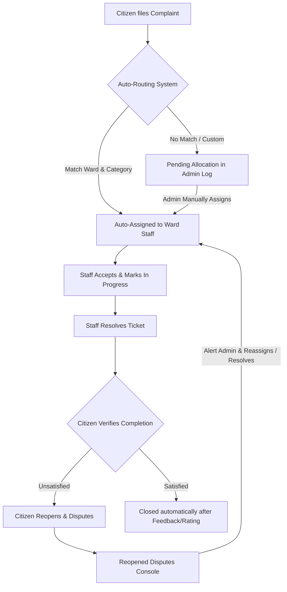

# 🏙️ FixMyCity (Prayagraj Municipal Corporation Portal)

FixMyCity is a MERN Stack municipal grievance redressal portal designed to bridge the communication gap between citizens and local government. By providing localized ward-level reporting, interactive mapping, auto-routed assignments, and verification feedback loops, the platform streamlines how public complaints are tracked, managed, and resolved in real-time.

The application is localized specifically for the **Prayagraj Municipal Corporation (PMC), Uttar Pradesh, India**, dividing the city into 6 administrative wards and restricting all reporting to verified local boundaries.

## 🔗 Live
- Frontend: [https://fix-my-city-woad.vercel.app/](https://fix-my-city-woad.vercel.app/)
- Backend API: [https://fixmycity-eyyn.onrender.com](https://fixmycity-eyyn.onrender.com)

## Screenshots


---

## 🚀 Key Features

### 1. Multi-Role Workflow (RBAC)
*   **Citizen Account**:
    *   File complaints with titles, categories, detailed descriptions, and photo attachments.
    *   Pin the exact location of issues on an interactive Map.
    *   Track complaint resolution status in real-time.
    *   Verify resolutions: citizens can close tickets with star ratings and comments, or reopen them if they are unsatisfied.
    *   Update profile settings and upload profile avatars.
*   **Department Employee Workbench**:
    *   Accesses a restricted feed displaying complaints corresponding *only* to their department and assigned ward.
    *   Accept tickets, set status to `In Progress`, and attach progress photos/remarks.
    *   Resolve tickets for citizen verification.
*   **Municipal Officer (Admin Dashboard)**:
    *   Consolidated analytics center tracking total complaints, active cases, staff numbers, and department workloads.
    *   Access to the **Municipal Complaints Central Log** to oversee all tickets, assign priorities (`Low`, `Medium`, `High`, `Critical`), allocate staff, and change department categories.
    *   User Management Console: Admin can register municipal staff, select their departments/wards, and block/unblock citizen accounts.

### 2. Geofenced Map Integration
*   Powered by **Leaflet & OpenStreetMap**.
*   **Map Selector**: Allows citizens to place a draggable coordinate marker or use browser geolocation to pinpoint issues.
*   **Geofence Guard**: Prevents users from pinning locations outside Prayagraj city limits (Latitude: `25.30` to `25.60`, Longitude: `81.65` to `82.05`) with interactive warnings and submit blocks.

### 3. Proactive Duplicate Upvote System ("Me Too")
*   When creating a complaint, picking a category and map location triggers a query searching for active, unresolved tickets of the same category within **100 meters**.
*   Shows a warning panel: **"Similar Active Complaints Found Nearby!"**
*   Allows the citizen to click **"Upvote & Subscribe"** instead of filing a duplicate.
*   **Auto-Escalation**: Complaints automatically upgrade to `High` priority at 3 upvotes, and `Critical` priority at 5 upvotes.

### 4. Enterprise-Grade Security (Rate Limiter)
*   Custom in-memory rate limiting middleware protecting endpoints:
    *   **Authentication & Registration Gate**: 5 requests per 30 minutes.
    *   **Lodging Complaints**: Max 3 complaints per 30 minutes per citizen.
    *   **Public Statistics**: Max 30 requests per minute to prevent DB exhaustion.

---

## 🛠️ Technology Stack

| Layer | Technologies |
| :--- | :--- |
| **Frontend** | React (Vite), TailwindCSS, React Hook Form, Recharts, Lucide React |
| **Backend** | Node.js, Express, MongoDB (Mongoose) |
| **Storage & Auth** | Cloudinary (Multer), JSON Web Tokens (JWT), BcryptJS |

---

## 📦 Getting Started

### 1. Environment Variables Configuration
Create a `.env` file in the `backend/` directory:

```env
PORT=5001
NODE_ENV=production
MONGO_URI=your_mongodb_atlas_connection_string
JWT_SECRET=your_jwt_signing_token
CLOUDINARY_CLOUD_NAME=your_cloudinary_cloud_name
CLOUDINARY_API_KEY=your_cloudinary_API_key
CLOUDINARY_API_SECRET=your_cloudinary_API_secret
```

### 2. Backend Setup
```bash
cd backend
npm install
npm run dev
```
*Note: On first startup, the database seeder will automatically initialize the collections, set up department parameters, and load demo accounts.*

### 3. Frontend Setup
```bash
cd ../frontend
npm install
npm run dev
```
The React dev server will spin up on `http://localhost:3000`.

---

## 🔄 Life of a Complaint: Workflow Lifecycle

FixMyCity implements a structured, closed-loop lifecycle for all public grievances:



### 1. Creation & Intelligent Auto-Routing
* When a **Citizen** lodges a complaint, the backend matches the category to a department and queries the database for the employee registered to that specific **Ward** and **Department**.
* If a match exists (e.g. *Road Damage* in *Ward 1: Civil Lines*), the ticket is automatically assigned to that employee (*Amit Sharma*), and the status shifts to `Assigned`.
* If no dedicated staff is found, the ticket drops into `Pending` status.

### 2. Administrator Supervision & Allocation
* The **Municipal Officer (Admin)** oversees the entire flow. They can filter unassigned tickets in the central log and manually allocate them to any active employee, adjust priorities (`Low` to `Critical`), or change departments.

### 3. Employee Execution
* The assigned employee accepts the ticket, shifting the status to `In Progress`.
* Upon completing repairs, the employee resolves the ticket, leaving progress comments and attaching optional photographic proof. The status updates to `Resolved`.

### 4. Citizen Verification & Feedback Loop
* Once resolved, the ticket is returned to the **Citizen's** dashboard for verification.
* If the citizen is satisfied, they submit feedback (1-5 star rating & optional comments) which automatically marks the case as `Closed`.
* If the citizen is unsatisfied, they can **Reopen** the complaint, entering their dispute explanation.

### 5. Dispute Resolution Workflow
* Reopening a ticket automatically reassigns it to the ward employee to prompt a fix, sets the status back to `Assigned`, and flags the ticket as `isDisputed = true`.
* An immediate dispute alert notification is dispatched to all **Municipal Officers**.
* The reopened ticket is placed in the Admin's **Reopened Disputes Console**, allowing them to closely monitor, reassign to a new department, change priority to `Critical`, or override the task.

---

## 👥 Demo Logins

**Use the following demo credentials to explore different user roles.**

(Scope: Road Department in Ward 1: Civil Lines. File a "Road Damage" complaint in Ward 1 as Citizen to test this workflow!) 

*   **Administrator (Municipal Officer)**:
    *   **Email**: `admin@fixmycity.gov`
    *   **Password**: `admin123`
*   **Staff Employee (Roads, Ward 1)**:
    *   **Email**: `road.emp@fixmycity.gov`
    *   **Password**: `employee123`
*   **Citizen Account (Nitin Singh)**:
    *   **Email**: `citizen@fixmycity.gov`
    *   **Password**: `citizen123`

---

## 🗺️ City Division (6 Wards)
Wards are pre-mapped to departments and staff members for auto-routing:
1.  **Ward 1: Civil Lines** (Employee: *Amit Sharma* — Road Department)
2.  **Ward 2: Katra** (Employee: *Priya Patel* — Water Department)
3.  **Ward 3: Georgetown** (Employee: *Rajesh Verma* — Electricity Department)
4.  **Ward 4: Naini** (Employee: *Sunita Rao* — Sanitation Department)
5.  **Ward 5: Ashok Nagar** (Employee: *Vikram Singh* — Parks Department)
6.  **Ward 6: Jhalwa** (Employee: *Sanjay Dwivedi* — Road Department)
